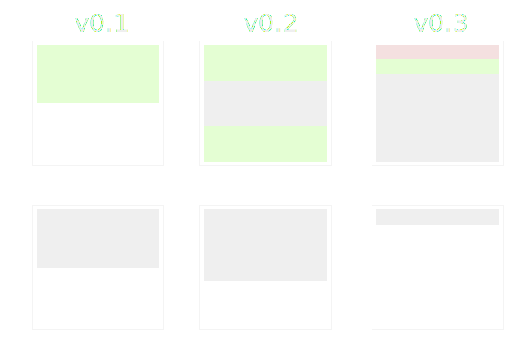

# Delta Encoding

A complete solution to optimize the size of data, is use [delta encoding](https://en.wikipedia.org/wiki/Delta_encoding) based in [data deduplication](https://en.wikipedia.org/wiki/Data_deduplication) and [data compression](https://en.wikipedia.org/wiki/Data_compression).

This provides a simple method to handle version control. Each blob has to represent its content and a reference of its source.

Also specify the encoding used when the blob was create in order to reconize which stragety take to decode.

## Why not store the raw


/_Pure text files generate a pure text delta.
Binary files generate a delta that may contain some binary data.
The delta encoding does not attempt to compress the content. It was considered to be much more sensible to do compression using a separate general-purpose compression library, like zlib._/

## Data Model

```proto
syntax = "proto3";

package delta.pb;

message Delta {
  // Parent reference if null the delta is considered as a new
  bytes Parent = 1;
  // Compressed delta data
  bytes Data = 2;
  // Allows to definine the strategy of encoding/decoding data
  uint8 Codec = 3
}
```

## Implementations

- [Golang](https://github.com/lot-sh/go-delta-encoding)
- [Javascript](https://github.com/lot-sh/js-delta-encoding)

## Codecs

- 0x1 [Fossil](<https://en.wikipedia.org/wiki/Fossil_(file_system)>)/[LZMA](https://es.wikipedia.org/wiki/LZMA)
- 0x2 [zdelta][http://cis.poly.edu/tr/tr-cis-2002-02.pdf]

# References

- https://github.com/balacode/go-delta
